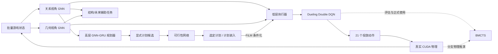
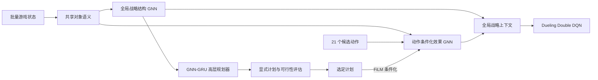

# 记录新模型总体技术方向

## 记录目的

本页保存新一轮强化学习模型的总体技术方向，便于后续逐项讨论。它只描述模块关系和
计划采用的主要技术，不是最终模型规格，也不提前冻结状态特征、网络层数、计划类型、
奖励或训练参数。

`codex/work-1` 中的旧模型、动态图、状态分析、因果归因和训练管线全部弃用。新方案只
建立在 accelerated-v1 当前已经验证的游戏规则、批量 Tensor 状态和 CUDA 物理模拟器
之上。

## 初始结构草案

图中的“关系视角”和“几何视角”是当前讨论占位名称，是否继续采用这两个视角、每个
视角负责什么信息以及如何融合，都尚未确认。

## 当前结构方向

后续讨论将双视角调整为“全局战略结构视角”和“动作条件化效果视角”。两者共享基础
对象语义，但分别接收适合自身职责的粗粒度战略信息和精确动作物理信息。

战略视角中的水果可联通性、多时间尺度直接合成机会、pair survival、数量敏感等级
聚合、理论进位、合并机会、合并债务和战略区域锚点已经形成独立算法设计，见
`docs/model/STRATEGIC_VIEW_CONNECTIVITY.md` 和
`docs/model/STRATEGIC_LEVEL_AGGREGATION.md`、
`docs/model/STRATEGIC_REGION_ANCHORS.md` 和
`docs/model/HIGH_LEVEL_PLAN_LIFECYCLE.md`。动作效果视角采用共享物理水果 GNN 和 21 个
只读水果消息的单向动作探针，见
`docs/model/ACTION_CONDITIONED_EFFECT_VIEW.md`；具体边特征与辅助目标仍待后续讨论。

## 技术方向

- 使用互补的 GNN 状态编码器理解水果、队列、投放动作和局面结构；
- 使用带记忆的高层 GNN-GRU 产生可解释、可持续执行的长期计划；
- 使用可行性网络评估计划在当前局面和可见队列下是否现实；
- 使用计划嵌入通过 FiLM 条件化低层 GNN，并由 Dueling Double DQN 选择离散投放动作；
- 使用结构理解和动作后结果预测等辅助任务改进共享表示；
- 基础强化学习训练不依赖 BMCTS，评估和正式使用时由 BMCTS 调用真实物理模拟器增强
  决策；是否增加独立的搜索蒸馏阶段留待后续确认。

显式计划的正式类型集合暂缓确定。当前先保留计划嵌入、可变时长生命周期和低层 FiLM
条件化接口，后续根据低层策略的真实轨迹比较人工显式计划、模型自行形成的潜在计划和
二者混合的方案，避免手工计划过早限制模型可探索的策略空间。

## 计划的训练阶段

总体顺序暂定为：GNN-DQN 基线、状态编码与基础技能课程、条件化低层策略、高层规划器、
高低层交替训练，以及最后的搜索增强。每一阶段的输入、目标和通过门禁将在对应讨论
完成后单独形成规格。

GNN-DQN 基线使用 1-step Double DQN，不聚合后续多次投放的 n-step 奖励。后续状态的
价值仍通过一步 TD bootstrap 传递，`settle_timeout` 继续作为可 bootstrap 的非终局
决策边界。

第一版训练系统已经进一步冻结：修复后的 30 FPS 物理独占训练数据，120 FPS 只用于
隔离 greedy 评估；单 GPU 管线使用 GPU Replay、端到端性能标定、按吞吐扩容和独立低
开销实时面板。完整规则见 `docs/model/GNN_DQN_TRAINING_SYSTEM.md`。

## 本次变更

本次只新增方向文档并更新文档索引，没有增加模型、奖励、训练代码或依赖，也没有修改
现有模拟器和状态契约。

## 验证

- Mermaid 图保持与讨论草案一致；
- 文档明确标注未确认部分和旧模型弃用边界；
- 当前源码和运行行为未发生变化。
