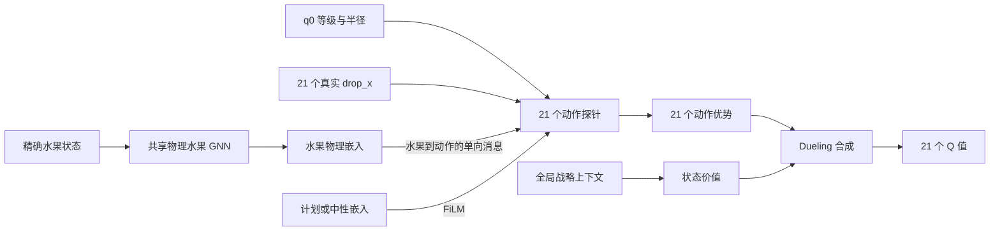

# 动作条件化效果视角算法设计

- 状态：核心结构边界已确认，边特征与网络实现尚待讨论
- 适用范围：低层 FiLM-GNN-Dueling Double DQN 的动作效果编码
- 非目标：本页不规定层数、隐藏维度、稀疏算子、辅助损失或具体训练参数

动作结果预测辅助任务不进入第一版 GNN-DQN 基线，作为后续模型升级项保留。第一版先
建立无动作辅助损失的稳定训练参考，再单独接入并比较它对样本效率、动作表示和最终
游戏指标的增益。

## 1. 核心结构

低层动作效果视角采用“一张共享物理水果 GNN + 21 个单向动作探针”。场上水果的精确
物理关系只编码一次，21 个动作探针并行读取共享水果表示，分别形成当前 21 个投放动作
的效果表示。

该结构不为每个动作复制一张完整水果图，也不让不同动作假设共同修改共享水果状态。



## 2. 共享物理水果 GNN

共享物理图负责表达当前真实水果之间的精确局部动力学结构，包括接触、近接触、支撑、
相对位置、半径、速度和可能传播碰撞影响的邻域。

水果物理表示与具体候选动作无关，因此只需计算一次。动作探针读取某颗水果时，可以
同时获得该水果已经聚合的邻近支撑和接触链信息，用于估计潜在的多水果连锁影响。

### 2.1 混合局部图

共享物理图不使用全连接，也不局限于当前接触关系，而是采用以下边集合的并集：

- 强制保留全部真实接触、重叠和碰撞容差内的水果边；
- 每颗水果补充若干条按表面距离选择的半径感知近邻边；
- 对根据相对位置和相对速度可能很快碰撞的水果补充运动边；
- 对横向投影重叠的水果保留最近的上方或下方纵向影响边；
- 水果与左墙、右墙和地面建立物理边界关系。

近邻选择使用圆形表面距离，而不是单独使用圆心距离：

```text
surface_gap = center_distance - (radius_i + radius_j)
```

所有真实接触边不受近邻数量上限影响，避免密集堆叠时丢失实际接触。水果之间按双向
消息处理，但相对方向、上下支撑、接近或远离等信息在两个方向上分别编码。

危险线不产生碰撞，只进入风险特征。远距离同级水果之间的长期可联通性继续由战略
Pair Encoder 负责，不因同级关系在物理图中额外建立长距离边。物理图只处理局部短期
碰撞及其传播。

### 2.2 水果节点状态边界

共享物理水果节点直接保留以下状态：

- 归一化精确位置 `x、y`；
- 归一化线速度 `vx、vy` 和角速度；
- 水果等级嵌入、物理半径以及由等级确定的质量或逆质量；
- 对数压缩后的 `age_frames`，后续通过消融判断是否长期保留。

节点或边可以从上述状态确定性派生速度大小、运动方向、物理稳定标志、水果顶部到危险
线的距离、是否越线、到墙壁和地面的表面距离，以及相对边界的接近速度。这些派生量不
要求模拟器维护重复状态。

以下数据不作为模型输入：

- `fruit_id`，只用于事件追踪、目标引用和监督标签；
- 圆形水果的绝对旋转角度；
- `active`，只作为有效节点掩码；
- 累计 `score`、`last_score`、`step_count` 和绝对 `physics_frame`；
- `done`，只作为批处理和训练终止掩码；
- 场上水果的显示半径，实际碰撞只使用物理半径。

`fruit_count、max_level、max_height、empty_space_ratio` 不重复写入水果节点。它们可以
由战略聚合和全局池化得到，并可在需要时作为辅助目标或全局价值摘要进行消融。

### 2.3 环境危险计时

当前失败规则包含跨物理帧累积的 `fail_frames`，但现有批量观察尚未暴露该进度。只看
几何状态无法区分“刚刚越线”和“即将达到失败时限”的局面，因此完整模型状态需要加入：

```text
danger_progress = fail_frames / danger_frame_limit
```

同时提供当前是否存在越线水果的环境级标志。危险计时变化可以从相邻转移得到，不需要
把绝对物理帧编号输入模型。

### 2.4 队列边界

q0 进入全部动作探针，包含等级、显示半径、物理半径和每个动作的真实 `drop_x`。
q1～q3 进入队列编码和全局上下文，不进入当前水果物理图；低层动作优势仍需读取该队列
上下文，为后续水果预留位置。

### 2.5 统一连续物理边

水果到水果的物理关系使用共享边编码器。不同候选来源不建立互斥的独立边网络，而是将
连续物理量与可同时成立的关系标签共同编码。

几何部分至少包括相对位置、圆心距离、单位接触方向、表面间距、半径和与半径比例、
横向投影重叠程度以及上下方向。局部量优先按两颗水果的半径和归一化，使相似接触结构
在不同等级下保持可比较尺度。

动力学部分至少包括相对线速度、沿接触法向的接近速度、切向相对速度、结合角速度的
接触面滑动趋势，以及保持当前速度时的近似碰撞时间和有效标志。近似碰撞时间只表示
短期趋势，不作为确定性碰撞结论。

关系多标签至少表达：

- 是否同级以及是否具备直接合成资格；
- 是否已经接触或重叠；
- 是否为上下支撑关系；
- 是否来自半径感知近邻候选；
- 是否来自运动碰撞候选；
- 是否来自纵向影响候选。

一条边可以同时拥有多个标签。消息按两个方向分别计算，并保留方向、上下位置和接近或
远离的符号信息。

水果到左墙、右墙和地面的边复用连续几何与运动表达，并增加边界类型、表面净空、法向
速度、切向速度和接触标志。危险线不属于物理碰撞边。

物理边不输入水果 ID、累计分数、绝对步数、战略层长期合成概率、人工好坏判断或手工
计算的最终冲量结果。

## 3. 并行动作探针

每个动作探针对应一个合法离散动作，并使用模拟器按照当前 q0 半径计算出的真实
`drop_x`。探针同时知道当前待投放水果的等级、显示半径、物理半径和生成位置。

动作探针需要回答的是“当前 q0 从该位置投放后可能产生什么效果”，而不是重复编码整张
局面。21 个探针使用共享参数并行产生动作表示，随后由动作优势分支输出对应 Q 值。

### 3.1 两级动作聚合

每个动作探针采用“全水果轻量软聚合 + 关键水果精细消息”的两级读取结构。

第一级对全部活动水果计算低成本、低维度的连续相关性和几何摘要，保证移动目标、遮挡
结构和远处风险不会因硬裁剪而完全消失。该路径不为每条动作到水果关系执行昂贵的完整
边网络。

第二级选择少量与当前动作最相关的水果，读取完整水果物理嵌入和动作相对几何。关键
集合至少覆盖：

- 名义上的前几个首次碰撞候选；
- 左右两侧可能发生擦边或偏转的水果；
- 正在进入投放走廊的运动水果；
- 与 q0 同级且具有直接合成可能的水果；
- 轻量相关性评分补充出的重要对象。

两级结果与动作自身表示融合后形成动作效果嵌入。关键对象选择依据客观几何和运动关系，
不受计划嵌入调制；FiLM 只改变效果融合和动作评价时各类后果的权重，避免计划条件导致
模型提前忽略客观风险。

具体关键对象数量、轻量聚合算子和候选并集上限在实现与性能测试阶段确定。

## 4. 单向消息边界

消息方向固定为共享水果节点到动作探针。动作探针不把候选动作消息写回共享水果节点，
不同动作探针之间也不传播消息。

21 个动作代表互斥的反事实假设。如果多个动作共同回写水果节点，“左侧投放”和“右侧
投放”的假设影响会在共享表示中混合，破坏每个动作效果的独立性。单向读取可以保持
反事实隔离，同时复用物理水果 GNN 的主要计算。

## 5. 动作与水果的几何信息

动作探针到水果的消息同时使用原始相对几何和确定性的投放走廊特征。派生几何只是对
当前状态的连续变换，用于降低模型从零学习圆形碰撞几何的样本需求，不作为手工策略或
确定性动作结论。

每条动作到水果关系至少表达：

- 水果相对 `drop_x` 的横向方向和距离；
- 水果相对生成位置的纵向距离；
- q0 与目标水果的半径关系；
- 垂直下落圆形与目标水果之间的横向净空；
- 静态几何下的名义接触高度和潜在遮挡顺序；
- 两者是否同级以及是否具备直接合成条件；
- 目标水果正在进入还是离开投放走廊；
- 目标水果已经聚合的局部接触、支撑和运动结构。

横向净空使用连续量表达：

```text
|fruit_x - drop_x| - (q0_radius + fruit_radius)
```

负值表示静态垂直路径存在相交可能，接近零表示擦边或偏转敏感区域，正值表示存在横向
间隔。该量不能用于硬编码首次碰撞对象，因为水果可能仍在运动，首次接触后也可能发生
滚动和连锁碰撞。

真实首次碰撞、最终落点、直接合成、碰撞传播和风险变化属于动作结果预测目标，不作为
执行动作前的已知输入。

共享物理水果节点保留精确位置、线速度、角速度、等级、物理半径和稳定状态。圆形水果
的绝对旋转角度不影响碰撞几何，默认不进入模型；角速度仍可能影响接触摩擦和滚动，
暂时保留。左右墙和地面可以形成固定物理边界消息，危险线只提供风险信息，不作为碰撞
边界。

## 6. FiLM 与 Dueling 读出

计划嵌入通过 FiLM 调制动作探针的消息聚合或效果读出，使相同物理后果在不同战略意图
下获得不同权重。基础水果物理表示保持计划无关，因为计划不会改变客观物理状态。

显式计划尚未确定或未进入高层训练时，低层使用中性计划嵌入。状态价值分支读取共享的
全局局面上下文，动作优势分支读取 21 个动作探针表示，再按 Dueling 结构合成 Q 值。
Double DQN 用于训练目标的动作选择与估值分离，不改变上述前向结构。

## 7. 计算边界

推荐结构的主要计算由以下部分组成：

```text
一次共享水果物理编码
+ 21 个共享参数的动作探针聚合
+ 一次状态价值与 21 个动作优势读出
```

算法上不采用 21 张完整水果图或 21 次独立网络前向。动作到水果采用稠密软聚合、几何
筛选还是混合方式，留待边特征和性能设计完成后确定。

## 8. 推迟到后续讨论的内容

- 混合局部图的近邻数量、距离范围和运动时间范围；
- `danger_progress` 暴露到批量观察的具体状态接口；
- 两级动作聚合的关键对象数量、软聚合算子和候选并集上限；
- 后续升级阶段的动作结果预测辅助任务；
- FiLM 调制的具体层位置；
- 动作效果表示与全局战略上下文的融合方式。
