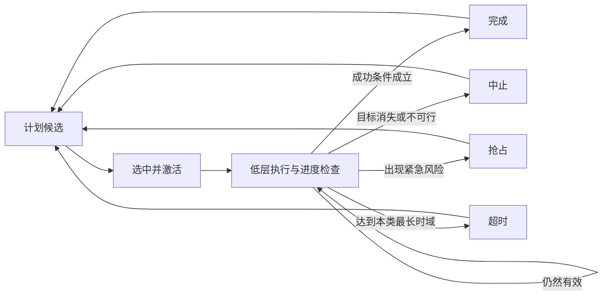

# 高层显式计划生命周期算法设计

- 状态：已确认的算法方向，尚未进入实现
- 适用范围：GNN-GRU 高层规划器产生的显式计划
- 非目标：本页不规定具体计划类型、最长步数、切换代价、奖励公式或训练算法

## 1. 核心原则

高层计划采用可变时长机制。计划不按照统一的固定投放周期强制结束，而是根据计划相关
事件完成或中止；不同计划类型可以具有不同的最长时域。

显式计划的正式类型集合暂缓确定。当前只冻结与计划语义无关的生命周期骨架，不要求
现在枚举或手工定义完整的游戏策略。后续将结合已经具备执行能力的低层策略、真实训练
轨迹和模型自行形成的行为模式，再比较人工显式计划、模型潜在计划及二者混合的方案。

高层计划描述一段时间内希望实现的局面变化。低层执行器在计划保持期间连续选择具体
投放动作，每次真实物理结算后更新计划进度、可行性和风险。

## 2. 生命周期

计划处于激活状态时，每次投放后都重新观察局面，但观察更新不等于强制更换计划。只要
目标仍然存在、计划仍然可行且没有达到终止条件，规划器默认继续当前计划。

## 3. 结束事件

计划至少可以由以下事件结束：

- **完成**：计划自己的成功条件已经满足；
- **中止**：目标消失、关键材料被消费或计划变得不可行；
- **抢占**：出现优先级更高的紧急危险，需要立即转入救险；
- **超时**：执行时间达到该计划类型允许的最长时域，但仍未完成。

完成、中止、抢占和超时必须在训练记录中保持不同语义，不能统一视为普通计划切换。

## 4. 不同计划采用不同最长时域

紧急救险、短期配对、长期合成链和场地结构调整的自然持续时间不同，因此不使用一个
统一时域覆盖全部计划。每种计划类型可以根据目标复杂度和紧迫程度设置自己的最长
时域；具体步数在计划类型和训练课程确定后再讨论。

最长时域只是防止计划无限拖延的边界，不代表计划必须执行到该时刻。成功、不可行或
紧急风险事件可以随时提前结束当前计划。

## 5. 计划保持与重新规划

候选集合需要能够表达“继续当前计划”。规划器可以在每次物理结算后更新当前计划的
记忆、进度和可行性，但不应因为分数轻微波动而频繁改变目标。

是否增加显式切换代价、最短承诺期或其它稳定机制暂未冻结。无论采用哪种方式，紧急
安全事件都必须允许抢占当前计划。

## 6. 对训练数据的要求

训练轨迹需要保留计划开始、持续、完成、中止、抢占和超时事件，并记录计划持续期间的
真实环境结果。高层训练样本由一段可变长度的低层执行组成，而不是把每次投放都误当成
一个全新的高层决策。

战略表示和计划进度辅助目标可以在早期训练阶段收集；高层规划器正式控制计划选择仍在
条件化低层执行器具备基础能力后进行。

## 7. 推迟到后续讨论的内容

- 第一版显式计划类型集合；
- 人工显式计划、模型潜在计划及混合计划的选择；
- 如何从真实轨迹发现、聚类和验证模型形成的策略；
- 每类计划的成功、中止和最长时域；
- 当前计划的进度表示；
- 是否设置最短承诺期或切换代价；
- 高层奖励、折扣和可变时长训练目标；
- 计划抢占的优先级规则。
