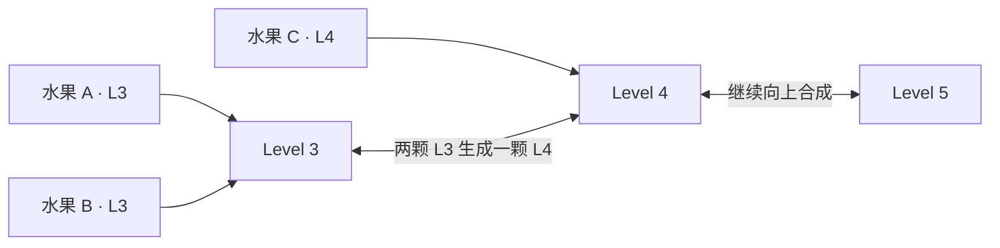

# 战略等级聚合、合并机会与合并债务算法设计

- 状态：已确认的算法方向，尚未进入实现
- 适用范围：新模型战略视角中的水果个体节点、等级节点和长期合并状态
- 非目标：本页不规定聚合层实现、网络尺寸、损失权重、奖励接线或张量布局

## 1. 目的

同等级水果的数量是衡量局面归并质量的重要信号。对于固定的当前水果集合，如果忽略
几何阻挡并持续执行同级合成，规范结果应当是每个等级最多保留一颗水果；两颗西瓜则
按当前规则相消。该状态表示当前材料已经完成理论上的充分归并。

但是，同级水果的出现既可能是高价值合并机会，也可能是长期无法处理的结构债务。
战略模型必须同时理解数量、可联通性、持续时间和局面风险，不能简单学习“同级水果
越多越差”。

## 2. 个体水果节点与等级节点

场上每颗真实水果保留独立的个体节点，用于表示具体材料所在区域、粗粒度高度、危险、
运动和与其它水果的可联通关系。水果 ID 只用于图索引和未来事件标签，不作为模型输入。

战略图固定保留 L1～L11 共 11 个等级节点。等级节点不是额外水果，而是同等级水果
消息的聚合位置，并通过相邻等级关系表达游戏的逐级合成规则。



等级节点暂时只聚合水果与同级 pair 的消息，不直接写入手工判断出的“好链”“坏链”或
旧分支式 motif。高阶战略含义由聚合表示和相邻等级传播学习。

## 3. 数量敏感聚合

等级聚合必须保留同等级水果数量。普通平均聚合会让一颗水果和多颗状态相似水果产生
近似相同的等级表示，因此不能作为唯一聚合方式。

每颗水果的等级消息需要包含可计数的存在信息，使数量敏感聚合能够区分：

```text
Level 3 当前有 1 颗
Level 3 当前有 2 颗
Level 3 当前有 4 颗
```

具体采用求和、计数通道、门控聚合或其它等价实现留待统一实现阶段决定。算法要求只是
等级表示必须保留数量，且不能因水果消息取平均而丢失重复材料信息。

## 4. 合并规范形态与理论进位

等级数量具有类似二进制进位的结构：

```text
2 × L1 → 1 × L2
2 × L2 → 1 × L3
...
2 × L10 → 1 × L11
2 × L11 → 相消
```

从当前 L1～L11 数量出发，忽略几何阻挡逐级进位，可以得到：

- 完全归并后每级应保留的 0/1 状态；
- 理论上尚需完成的合成工作量；
- 当前材料理论上可以推进到的最高等级；
- 某一级的重复材料会给后续等级带来多少承接需求。

该计算提供的是当前材料的算术归并上界，不代表真实局面一定能够完成这些合成，也不
代表没有同级重复的局面一定安全。几何阻挡、顶部危险、空间布局和未来队列仍需由其它
战略信息共同判断。

## 5. 合并机会与合并债务

战略表示明确区分两个概念。

### 5.1 合并机会

`merge_opportunity` 表示当前同级材料能够在有限时域内完成合成的机会。它综合：

- 同级水果数量；
- 同级 pair 的几何通达度；
- `p_merge_1/4/16/64`；
- `p_pair_survival_H`；
- 当前区域与危险状态。

两颗强联通、预计很快合成的同级水果属于高价值机会，不应仅因数量为 2 被视为失败。

### 5.2 合并债务

`merge_debt` 表示当前材料距离充分归并仍有多少未完成工作，以及这些工作变成长期负担
的程度。它综合：

- 超过每级 0/1 规范形态的重复数量；
- 逐级理论进位产生的总合成工作量；
- 理论配对数与当前可实现配对数的差距；
- 重复材料持续未被处理的时间；
- 低可联通、被阻挡、占据空间和靠近危险线的程度；
- 材料被其它竞争合成消费的风险。

合并债务高表示模型积累了大量难以消化的重复材料。合并机会高则表示重复材料可能很快
转化为更高等级。两者必须同时保留，不能互相替代。

## 6. 等级节点聚合的信息来源

每个等级节点至少聚合两路战略消息：

```text
同等级水果个体消息
→ 数量、区域、危险、运动和材料分布

同等级 Pair Encoder 消息
→ 可实现配对、短中长期合成机会和 pair survival
```

相邻等级节点继续传播承接信息。例如 Level 3 的多颗材料可能进位产生 Level 4，而
Level 4 当前已有的水果又可能成为下一次合成的承接目标。模型由此学习跨等级的合并
链条，不需要手工生成链条节点。

## 7. 局面解释

| 同级状态 | 战略含义 |
| --- | --- |
| 0 或 1 颗 | 当前等级已处于规范归并状态 |
| 2 颗且强联通 | 高价值的短期合并机会 |
| 2 颗且弱联通 | 受阻的合并债务 |
| 多颗且存在多个强联通 pair | 工作量较大但仍具有恢复和连锁机会 |
| 多颗且长期弱联通 | 明显的战略积压 |
| 多颗且占据危险区域 | 需要优先处理的高风险债务 |

“每级最多一颗”是重要的材料归并标准，但不是完整局面的唯一最优性标准。单颗水果仍
可能被埋藏、阻挡未来投放或堆积在危险线附近。

## 8. 辅助监督方向

为了确保等级表示确实编码数量与归并状态，可以使用以下辅助目标：

- 当前等级水果数量；
- 当前等级是否满足 `count <= 1`；
- 理论上可以向下一级进位的数量；
- 当前可实现的同级配对数量；
- 未来 `1/4/16/64` 步后是否收敛到 0 或 1 颗；
- 合并债务在未来是下降、持平还是增加。

这些目标来自当前状态、Pair Encoder 输出和真实未来轨迹，不需要额外反事实重演。

## 9. 使用边界

第一版先将合并机会和合并债务用于：

- 战略等级表示；
- 高层计划候选与计划完成条件；
- 计划可行性判断；
- 辅助任务；
- 模型评估和逐项消融。

暂不把原始同级数量或合并债务直接写入环境奖励。只有在证明它与真实游戏分数、最高
等级、局长和终局风险稳定相关后，才讨论是否采用潜势塑形，避免模型为减少重复数量而
执行危险或过早的合成。

## 10. 验证原则

后续需要分别验证：

- 数量敏感聚合能否区分同等级 1、2、4 等不同数量；
- 等级表示能否预测理论进位和真实可实现配对；
- `merge_opportunity` 能否识别即将完成的高价值 pair；
- `merge_debt` 能否识别长期受阻和危险积压；
- 每级 0/1 规范度与游戏分数、最高等级、空间和终局表现的相关性；
- 仅使用数量、加入可联通性、加入持续时间和风险后的逐项消融。

## 11. 推迟到实现阶段的内容

以下内容尚未冻结：

- 数量敏感聚合的具体算子；
- 理论进位、可实现配对和长期债务的输出形式；
- 合并债务的归一化及等级权重；
- 重复材料持续时间的表示方式；
- 辅助损失权重和训练阶段；
- 是否在验证后将其用于潜势奖励。

这些内容将在战略区域、显式计划、动作效果、奖励和训练方案全部闭合后统一实现。
