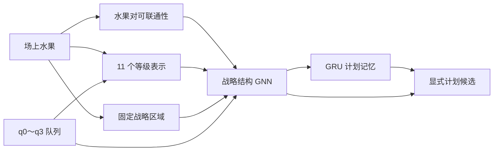

# 战略视角与水果可联通性算法设计

- 状态：已确认的算法方向，尚未进入实现
- 适用范围：新模型战略状态编码与高层规划
- 非目标：本页不规定张量接口、网络尺寸、层数、损失权重、存储格式或代码结构

## 1. 目的与边界

战略视角负责形成面向长期计划的局面抽象，回答当前有哪些合成材料、哪些区域值得
经营、哪些结构可能发展为合成链，以及哪些计划可能因阻挡或材料流失而失败。它不负责
预测 21 个具体投放动作的精确碰撞和落点，后者属于动作条件化效果视角。

战略视角采用共享对象语义之上的多尺度 GNN，主要包含场上水果、11 个等级、固定战略
区域、q0～q3 队列和全局战略表示。水果之间只保留少量客观、可批量计算的候选关系，
不恢复旧分支中的动态 motif、重型状态分析或因果归因管线。

等级节点的数量敏感聚合、理论进位、合并机会与合并债务见
`docs/model/STRATEGIC_LEVEL_AGGREGATION.md`。

## 2. 战略结构方向



战略分支只使用粗粒度空间、等级、队列、危险、材料和结构关系。精确坐标、碰撞间隙、
第一接触对象和单个动作造成的局部物理结果由动作效果分支处理。处于
`settle_timeout` 时，战略视角仍需保留区域运动风险，不能把局面当成已经稳定。

## 3. 可联通性的含义

水果 A、B 的可联通性描述它们在当前阻挡结构和后续有限调整下发生接触或直接合成的
机会。它不是单一几何距离，也不能由一个不可解释标量完全替代。

算法上拆分为以下信息：

- **几何通达度**：A、B 之间的直接或替代通道是否存在，以及剩余空间大小；
- **阻挡严重度**：通道中阻挡水果的数量、覆盖程度和稳定性；
- **释放趋势**：A、B 是否接近，阻挡是否正在远离通道，局面运动是否可能解除阻挡；
- **等级兼容性**：是否同级、是否为相邻等级，以及是否能支持后续等级演进；
- **未来直接合成机会**：在有限投放时域内，A、B 直接成为同一次合成来源的概率；
- **关系不确定性**：当前证据是否足以支持稳定判断。

几何通达度、阻挡和运动的基础量由当前状态确定性计算。共享的轻量 Pair Encoder 负责
组合这些量，输出学习型边表示和未来结果预测。战略 GNN 同时接收客观基础量与学习型
表示，不能只依赖一个最终概率。

## 4. Pair Encoder 的位置

```text
A、B 的等级与粗粒度状态
+ A—B 通道和阻挡摘要
+ 当前运动与释放趋势
            ↓
共享轻量 Pair Encoder
            ├── 学习型 edge embedding
            ├── 多时间尺度直接合成结果
            └── 多时间尺度 pair survival
            ↓
战略 GNN 的水果—水果软边
```

所有候选水果对共享同一套 Pair Encoder。可联通性作为边特征、注意力偏置和软门控
使用；训练早期不据此硬删除边。低分关系仍然保留阻挡原因和未来解除阻挡的信息。

几何接触机会近似对称，但“将 A 引导到 B”和“将 B 引导到 A”可能不同。战略表示
允许同时保留对称的 pair 机会和方向性的通达信息；具体表达形式留待实现阶段确定。

## 5. 多时间尺度结果

直接合成概率使用以下累计时域：

- `p_merge_1`：1 次投放以内；
- `p_merge_4`：4 次投放以内，对应当前可见 q0～q3 的主要窗口；
- `p_merge_16`：16 次投放以内的中期调整；
- `p_merge_64`：64 次投放以内的长期经营结果。

模型不独立预测四个无约束概率，而按对数时间区间建模：

```text
I1 = 第 1 步
I2 = 第 2～4 步
I3 = 第 5～16 步
I4 = 第 17～64 步
```

每个区间在“此前尚未解决”的条件下预测三种互斥结果：

1. A、B 在本区间直接合成；
2. 原 A—B 机会在本区间被破坏；
3. 两颗材料继续保持可用，进入下一时间区间。

由区间结果统一推导累计 `p_merge_H` 和 `p_pair_survival_H`，避免多个独立概率互相
矛盾，并保证 `p_merge_1 <= p_merge_4 <= p_merge_16 <= p_merge_64`。

这里的 `p_pair_survival_H` 表示原 A—B 合成机会在 H 步内没有被竞争事件破坏：A、B
已经直接合成视为计划成功；若尚未合成，则两颗材料仍需保持可追踪、未被其它合成消费。
若需要严格表示“两颗原始水果在 H 时刻仍独立存在”，以后可以从同一区间结果另行
派生，不在第一版增加独立预测头。

`p_merge_16` 和 `p_merge_64` 会受到未来随机队列和行为策略影响，因此它们表示当前
行为或计划条件下的经验概率，不等于脱离策略的数学可达性，也不能作为硬可行性规则。

## 6. 监督事件与边界

第一版只监督同等级原始水果 A、B 是否直接共同成为一次 `MergeEvent` 的来源，不把
后代谱系汇合混入同一概率语义。

标签遵循以下规则：

- A、B 直接合成：对应时间区间的成功事件；
- A 或 B 先与其它水果合成：原 pair 被竞争事件破坏；
- 游戏真实终止：尚未完成的 pair 机会被破坏；
- 跑满可信观测范围但没有结果：只监督已经完整观察的区间，后续区间使用 mask；
- `settle_timeout`：继续同一局跟踪，不作为中断或负样本；
- 真正的技术截断或数据缺失：超出可信边界的标签不参与损失。

当前模拟器的合成事件已经包含来源水果 ID，因此可以从真实轨迹生成上述短期标签，
无需把完整物理快照、反事实重演或长期状态机放入环境热路径。

## 7. 训练方案

### 7.1 基础几何学习

先用当前状态可确定计算的通道类别、阻挡严重度、剩余空间和释放趋势训练 Pair Encoder
理解基础几何语义。可以使用排序约束保证通道畅通的关系评分高于轻微阻挡，轻微阻挡
高于完全封闭。

### 7.2 真实未来结果学习

再使用真实轨迹中的合成、竞争消费、终止和继续存活事件训练四个对数时间区间。训练
数据需要覆盖随机动作、简单启发式、GNN-DQN 基线和后续逐渐增强的策略，避免长期概率
只反映某一个早期行为策略。

正样本全部保留；负样本按等级、距离和阻挡程度分层抽样，并保留通道畅通却未合成、
初始受阻却最终成功等困难样本。类别不平衡处理不能破坏最终概率校准。

### 7.3 与战略 GNN 联合训练

接入完整模型后，学习型 edge embedding 可以同时接受几何辅助、未来事件监督和下游
战略/RL 梯度。可解释的未来概率保持由真实事件监督主导；必要时在作为战略输入时阻止
TD 梯度直接扭曲其概率语义。

本页不决定各损失权重、预训练时长、学习率或冻结顺序，这些参数在完整训练设计闭合后
统一确定。

## 8. 候选关系范围

第一版重点处理：

- 同等级水果对：建立完整可联通表示并训练直接合成结果；
- 相邻等级水果对：作为等级承接和合成链结构边，暂不复用直接合成标签；
- 少量空间近邻：帮助战略 GNN理解支撑、阻挡和区域联系。

不为所有水果无条件建立全连接边。候选筛选方式、近邻数量和距离边界属于实现与性能
设计，后续结合批量 CUDA 成本确定。

## 9. 战略使用方式

Pair Encoder 的输出用于：

- 判断同级材料是否值得制定立即合成或构造同级对计划；
- 判断相邻等级材料是否具备继续承接的结构条件；
- 汇总到等级和区域表示，辅助形成长期合成链计划；
- 为计划可行性网络提供材料保留、成功和被竞争消费的风险信息。

“A、B 当前是否具有未来机会”属于战略视角；“具体动作 i 会让 A、B 更接近还是更远”
属于动作条件化效果视角，后者不在本页定义。

## 10. 验证原则

Pair Encoder 需要独立检查：

- 不同时间尺度的 PR-AUC、概率校准和 Brier Score；
- 高评分水果对的真实合成召回率；
- 按等级、距离、阻挡程度、策略版本分别统计；
- 累计合成概率的单调性；
- pair 成功、继续可用和竞争破坏三类结果的一致性；
- 无可联通信息、仅确定性几何、加入 Pair Encoder、加入未来监督的逐项消融；
- 接入战略规划后，真实计划完成率和最终游戏指标是否改善。

## 11. 推迟到实现阶段的内容

以下内容尚未冻结：

- 精确几何通道和阻挡量的计算公式；
- 战略区域数量的最终取值；
- Pair Encoder 和战略 GNN 的网络尺寸；
- 候选边筛选和批量张量布局；
- 损失权重、采样比例和 replay 存储方式；
- 是否以及何时增加后代谱系汇合预测；
- 计划条件化的长期合成概率如何接入。

这些内容将在其它算法模块确定、整体训练数据流闭合后统一设计和实现。
